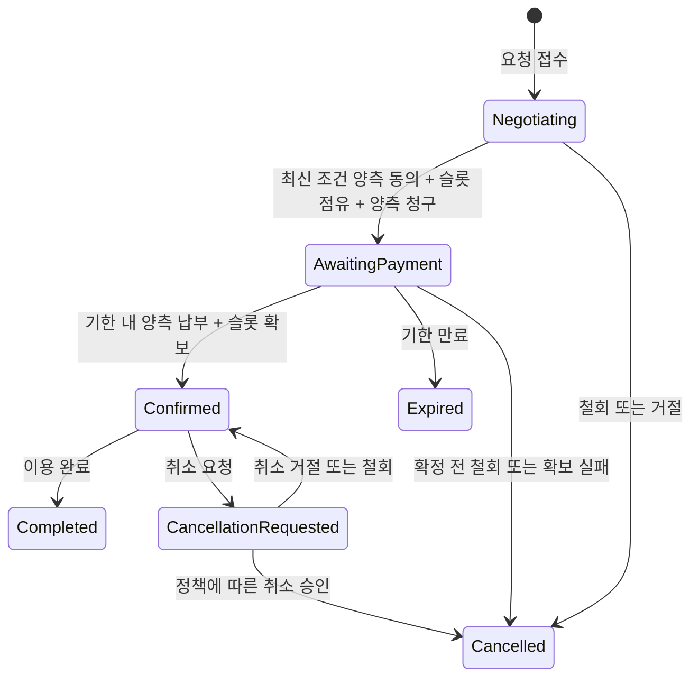

# 예약·협의·양측 수수료 설계

작성일: 2026-10-08
구분: 승인된 운영 정책을 구체화한 설계 초안. 기술 스택에 종속되지 않음.

## 1. 기준과 미정 항목

승인된 기준: PC·모바일 브라우저, 공개 시설 슬롯, 참가자 양측 조건 합의, 동일 기준 수수료, 양측 납부 후 최종 확정, 초기 결제 기한 30분, 미성사 시 납부금 전액 취소 요청.

미정: 수수료 액수·계산식, 팀·개인별 청구 단위, 단독 시설 예약 과금, 로그인·알림·PG·기술 스택, 확정 후 환불·변경 규칙. 미정 과금 유형은 실결제 가능 상품으로 공개하지 않는다. 관리자 승인 없이 데모 가격을 실제 가격으로 사용하지 않는다.

야구 팀 대 팀에는 대표 계정 두 개를 연결하는 방안을 제안한다. 선수 개인별 청구는 확정 정책이 아니다. 골프 조인은 다수 참가 가능성이 있으므로 양측의 구성과 슬롯 수량을 상품 정책으로 정의한 뒤 실결제를 적용한다.

## 2. 사용자 화면 흐름

| 화면 | 핵심 정보와 행동 |
| --- | --- |
| 탐색 | 골프·야구, 예약·조인·매칭, 지역·날짜 필터 |
| 시설·모집 상세 | 슬롯별 날짜·시간·요금·옵션·인원과 현재 예약 가능 여부 |
| 예약 요청 | 선택 슬롯, 인원 또는 팀, 요청 조건, 상대방 |
| 협의 상세 | 메시지, 최신 조건 카드, 대체 슬롯 제안, 양측 동의 상태 |
| 결제 대기 | 확정 예정 조건, 내 수수료, 상대방 납부 여부, 공통 종료시간, 결제 버튼 |
| 예약 상세 | 확정번호, 시설·시간·참가자·조건, 내 결제 기록, 취소 요청 |
| 종료 내역 | 만료·취소 사유, 내 환불 진행 상태, 다시 요청하기 |

모바일에는 탐색·예약·협의·내 정보 중심의 탐색 구조를 제안한다. 화면에 '협의 중', '결제 대기', '예약 확정'을 명확히 구분한다. 상대방 카드 정보나 결제 식별자는 노출하지 않고 납부 여부만 표시한다.

시설 운영자는 슬롯 공개·중지, 시설 요금, 예약 일정과 문의를 관리한다. 활성 점유·확정 예약이 있는 슬롯을 삭제하거나 시간을 바꾸는 작업은 차단하고 별도의 취소·변경 절차로 안내한다. 관리자는 결제·환불 오류와 시설 충돌을 조회하고 조치 사유를 기록한다.

## 3. 예약 상태 전이

만료·취소 후 결제 성공이 도착해도 확정으로 전이하지 않는다. 납부금이 있으면 별도 환불 작업을 만든다. 예약의 종료 상태는 환불이 아직 처리 중이어도 유지한다. 이미 확정된 예약의 시간·참가자·가격은 직접 덮어쓰지 않는다.

## 4. 슬롯 점유와 동의

- 조건 제안은 수정 대신 새 버전을 생성한다. 각 동의는 제안 버전에 연결한다.
- 두 동의가 최신 동일 버전에 모일 때 서버가 슬롯·정책·당사자 권한을 다시 확인한다.
- 이용 자원 단위로 유효 점유와 확정 예약을 확인하고 원자적으로 점유한다. 동시에 합의된 경쟁 요청 중 자원 확보에 성공한 요청만 결제 대기로 들어간다.
- 양측 청구와 점유 생성은 한 작업으로 처리한다. 수수료 정책이 없거나 한쪽 청구 생성이 실패하면 결제 대기를 열지 않는다.
- 점유 종료시간은 서버 기준이며 양측 청구에 공통으로 적용한다. 초기 30분과 시설 허용시간 중 짧은 시간을 사용한다.
- 결제 대기 중 조건 변경은 현재 시도를 종료하고 납부금 취소를 요청한 후 새 제안으로 협의한다. 새 결제 시도는 별도 식별자를 사용한다.
- 골프 티타임의 판매 수량과 조인 좌석 수량을 구분한다. 조인 참가마다 코스 전체를 다시 점유하지 않는다.
- 야구는 동일 구장 이용 구간의 겹침을 차단한다. 여러 공개 슬롯이 같은 자원을 가리켜도 자원 기준으로 검사한다.
- 외부 시설 점유는 내부 데이터베이스만으로 보장되지 않는다. 외부 연동 또는 시설의 확인·운영 약정이 필요하다.

## 5. 데이터 모델

| 개체 | 핵심 필드·관계 |
| --- | --- |
| Account / FacilityMembership | 계정, 역할, 담당 시설 및 권한 |
| Facility / Resource | 시설, 코스·구장 등 예약 자원 |
| Slot | 자원, 시작·종료 시간, 수량, 공개 상태, 가격·옵션 버전 |
| Listing / Team / Participation | 예약·조인·매칭 상품, 팀, 모집·참가 내역 |
| BookingParty | 예약 당사자 식별자, 대표 계정, 당사자 유형 |
| Booking | 상품·슬롯, 현재 상태, 최신 제안, 확정 조건, 참가 약속과 시설 예약 연결 |
| Proposal / Consent | 조건 버전, 동의자·당사자, 동의 시간 |
| Conversation / Message | 예약에 연결된 대화, 참여 권한, 메시지 |
| Hold | 예약·시도·자원·수량, 시작·종료·만료시간, 활성·전환·해제 상태 |
| FeePolicy / FeeCharge | 정책 버전, 청구 당사자, 금액·통화, 결제 기한, 청구 상태 |
| PaymentAttempt | 청구, 시도 식별자, PG 거래 식별자, 서버 확인 결과 |
| Refund | 납부 건, 사유, 요청 금액, 처리 상태, 재시도 기록 |
| AuditLog / ProcessingJob | 운영 변경 이력, 결제·환불·알림 후속 작업 |

최소 제약: 예약 시도와 당사자별 청구는 각각 하나, 결제 제공자 거래 식별자 중복 불가, 활성 자원 점유가 허용 수량을 초과할 수 없음, 환불 누적 금액은 실제 납부 금액을 초과할 수 없음. 확정 조건과 적용 수수료 정책은 이후 정책 변경에도 유지한다.

## 6. API 계약 초안

| 요청 | 용도 | 권한·주요 조건 |
| --- | --- | --- |
| GET /facilities, /listings | 시설·상품 탐색 | 공개 정보만 반환 |
| GET /facilities/{id}/slots | 공개 슬롯 조회 | 비공개 운영 데이터 제외 |
| POST /operator/facilities/{id}/slots | 슬롯 생성 | 해당 시설 운영자 |
| PATCH /operator/slots/{id} | 슬롯 공개·정보 변경 | 활성 점유·예약 충돌 검사 |
| POST /bookings | 슬롯 기반 요청 생성 | 회원·상품 정책 확인 |
| POST /bookings/{id}/proposals | 새 조건 제안 | 해당 협의 당사자 |
| POST /bookings/{id}/consents | 특정 버전 동의 | 당사자 권한, 최신 버전 확인 |
| GET /bookings/{id} | 현재 상태·기한·내 청구 조회 | 당사자·담당 시설·권한 있는 관리자 |
| POST /bookings/{id}/messages | 협의 메시지 | 대화 참여자 |
| POST /charges/{id}/payment-attempts | 내 청구 결제 시작 | 청구 대상 계정, 활성 결제 기한 |
| POST /payments/confirm | 결제 결과 서버 확인 | 로그인 사용자와 주문 연결, PG 결과 검증 |
| POST /payments/webhook | 결제·환불 후속 결과 수신 | 선택 PG의 인증·검증 방식 적용 |
| POST /bookings/{id}/cancellation-requests | 취소 요청 | 당사자, 현재 상태·정책 확인 |
| GET /me/bookings, /me/charges | 자신의 내역 | 본인 범위 |
| GET /admin/payment-issues | 결제·환불 오류 조회 | 관리자 |

동의·청구·결제·취소 요청에는 반복 요청 식별자를 적용한다. 클라이언트가 보낸 수수료 금액·예약 상태를 신뢰하지 않는다. 최신 제안 충돌, 자원 확보 실패, 기한 만료는 구분된 오류로 반환해 화면에서 재협의·다시 선택을 안내한다.

## 7. 결제와 만료 경합 처리

브라우저의 결제 성공 화면만으로 납부 완료를 기록하지 않는다. 서버가 금액·통화·청구 대상·거래 결과를 검증한다. PG 호출과 내부 데이터베이스 갱신은 하나의 트랜잭션으로 묶을 수 없으므로 후속 확인과 취소 작업으로 복구한다.

두 결제가 모두 확인된 뒤 예약과 점유를 잠그고 현재 상태·기한·수량을 재검사한다. 유효한 예약만 확정하고 임시 점유를 확정 점유로 전환한다. 만료 처리도 같은 예약·점유에 대한 경합 규칙을 사용한다. 화면의 카운트다운은 안내용이며 만료 판단은 서버가 한다.

만료 이후 확인된 성공 결제는 취소 작업으로 처리한다. 두 결제 중 하나가 실패하면 기한 내 재시도를 허용하며, 기한이 지나면 성공한 결제도 전액 취소 요청한다. 환불 실패는 조용히 완료로 처리하지 않고 관리자 오류 목록과 재시도 작업에 남긴다.

## 8. 구현 순서와 완료 조건

| 단계 | 작업 | 완료 조건 | 선행 조건 |
| --- | --- | --- | --- |
| 1 | 반응형 화면 시안 | 공개 슬롯·협의·양측 결제 대기·확정·만료 화면을 연결 | 본 문서 |
| 2 | 계정·권한·시설·슬롯 | 시설별 권한과 자원 기준 슬롯 조회·변경 | 기술 스택·로그인 결정 |
| 3 | 요청·제안·동의·점유 | 조건 버전 동의와 경쟁 요청 중복 방지 | 슬롯·당사자 모델 |
| 4 | 청구·결제·만료·환불 | 양측 납부만 확정, 만료·늦은 결제 취소 처리 | 수수료 단위·금액, PG, 시설 점유 |
| 5 | 조인·팀 매칭·운영 | 참가 수량·약속·시설 확보 연결, 오류·취소 관리 | 상품별 과금과 취소 정책 |

각 단계에서 변경 파일·구현된 동작·미완성 부분을 기록한다. 목업과 실결제를 화면과 작업 보고에서 구분한다. 사용자 요청·승인 없이 테스트·빌드·배포를 수행하지 않는다.

## 9. 영향 파일과 다음 결정

설계 단계의 변경 파일: docs/requirements-draft.md, docs/payment-policy-proposal.md, docs/booking-design.md.

후속 구현: prototype/index.html, prototype/styles.css, prototype/app.js에 반응형 정적 시안을 작성했다. 데모 조작 흐름과 제한은 prototype/README.md, 단계별 기록은 docs/worklog.md에 정리했다. 작성한 시안은 브라우저 실행 검증 전이며 실제 서버·PG와 연결되지 않았다.

코드 파일의 실제 경로는 기술 스택 결정 후 구체화한다. 필요한 구현 범위는 탐색·협의·결제 화면, 시설·예약·결제 서버, 데이터 스키마, 만료·환불 후속 작업, 운영자·관리자 화면이다.

다음으로 반응형 웹 기술 선택지와 장단점을 비교한다. 기술 스택, 실결제 금액, 단독 시설 예약 과금, 확정 후 취소 정책을 승인 없이 확정하지 않는다.
